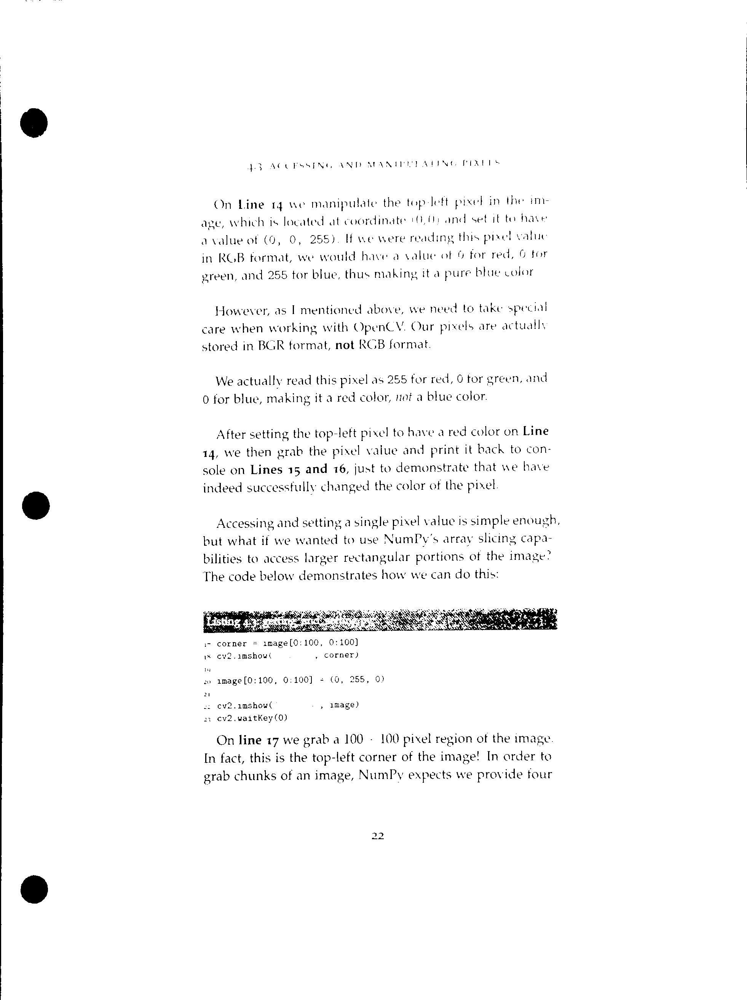

我是在python3.7的环境下运行的项目，首先安装依赖库

`pip install -r requirements.txt`

# OCR

先运行文件scan.py，所需参数如下

```python
ap.add_argument("-i", "--image", required=True,
                help="Path to the image to be scanned")
```

需要在控制台下运行如下代码

`python scan.py -i images/page,jpg`

运行后查看scan.jpg，为经过OCR扫描后生成的图片



接着运行baidu-orc.py，来识别其中的内容（[百度OCR文档](https://ai.baidu.com/ai-doc/OCR/1k3h7y3db)）

想要使用baidu-ocr接口需要申请，使用POST请求访问对应的服务器地址即可，返回值是json数据，我们使用如下代码读取

```python
with open('身份证.jpg', 'rb') as f:
    image = f.read()
    inf = client.basicGeneral(image, options)
    for words in inf['words_result']:
        print(words['words'])
```

想要做不同的操作只要更改相应的代码即可，因运行结果设计敏感信息不做展示。
