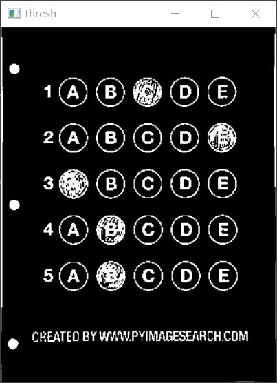
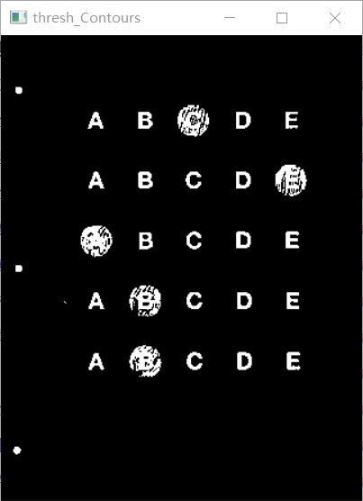

# 答题卡识别

我是在python3.7的环境下运行的项目，首先安装依赖库

`pip install -r requirements.txt`

所需要的arguments

```python
ap.add_argument("-i", "--image", required=True,
                help="path to the input image")
```

运行命令`python get_answer.py -i images/test_02.png`

运行截图如下





。。。

